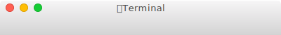

# @svag/toolbar

[](https://npmjs.org/package/@svag/toolbar)

`@svag/toolbar` is a macOS toolbar.

```sh
yarn add -E @svag/toolbar
```

## Table Of Contents

- [Table Of Contents](#table-of-contents)
- [API](#api)
  * [`toolbar(options: ToolbarOptions)`](#toolbaroptions-toolbaroptions-void)
    * [`ToolbarOptions`](#toolbaroptions)
- [TODO](#todo)
- [Copyright](#copyright)

## API

The package is available by importing its default function:

```js
import toolbar from '@svag/toolbar'
```

### `toolbar(`<br/>&nbsp;&nbsp;`options: ToolbarOptions,`<br/>`): void`

__<a name="toolbaroptions">`ToolbarOptions`</a>__: Options to make a toolbar.

| Name | Type | Description | Default |
| ---- | ---- | ----------- | ------- |
| title | _string_ | An optional title to display in the toolbar. | - |
| __width*__ | _number_ | The width of the toolbar. | - |

Generate a part of the `SVG` which represents a macOS toolbar.

```js
import toolbar from '@svag/toolbar'

const res = toolbar({
  title: '👾Terminal',
  width: 800,
})

console.log(res)
```

```svg
<linearGradient x1="50%" y1="0%" x2="50%" y2="100%" id="toolbar">
  <stop stop-color="#FFFFFF" offset="0%"/>
  <stop stop-color="#F5F4F5" offset="5%"/>
  <stop stop-color="#D3D3D3" offset="100%"/>
</linearGradient>
<path d="M6,0 L794,0 C 797 0, 800 3, 800 6 L800,22 L0,22 L0,16 C 0 8, 3 0, 6 0" fill="url(#toolbar)"/>
<text x="400" y="16" font-family="HelveticaNeue, Helvetica Neue" font-size="13" letter-spacing="0.4" fill="#464646" text-anchor="middle">👾Terminal</text>
<g transform="translate(9, 6)">
  <g>
    <circle fill="#FF5F52" cx="5" cy="5" r="5.25"/>
    <circle stroke="#E33E32" stroke-width="1" cx="5" cy="5" r="5.5"/>
  </g>
  <g>
    <circle fill="#FFBE05" cx="25" cy="5" r="5.25"/>
    <circle stroke="#E2A100" stroke-width="1" cx="25" cy="5" r="5.5"/>
  </g>
  <g>
    <circle fill="#15CC35" cx="45" cy="5" r="5.25"/>
    <circle stroke="#17B230" stroke-width="1" cx="45" cy="5" r="5.5"/>
  </g>
</g>
```


## TODO

- [ ] Add a new item to the todo list.

## Copyright

(c) [SVaG][1] 2018

[1]: https://svag.co
