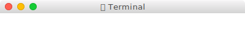
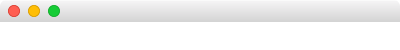

# @svag/toolbar

[](https://npmjs.org/package/@svag/toolbar)

`@svag/toolbar` is a macOS toolbar.

```sh
yarn add -E @svag/toolbar
```

## Table Of Contents

- [Table Of Contents](#table-of-contents)
- [API](#api)
  * [`toolbar(options: ToolbarOptions)`](#toolbaroptions-toolbaroptions-void)
    * [`ToolbarOptions`](#toolbaroptions)
    * [without a title](#without-a-title)
- [TODO](#todo)
- [Copyright](#copyright)

## API

The package is available by importing its default function:

```js
import toolbar from '@svag/toolbar'
```

### `toolbar(`<br/>&nbsp;&nbsp;`options: ToolbarOptions,`<br/>`): void`

Generate a part of the `SVG` which represents a macOS toolbar.

__<a name="toolbaroptions">`ToolbarOptions`</a>__: Options to make a toolbar.

| Name | Type | Description | Default |
| ---- | ---- | ----------- | ------- |
| title | _string_ | An optional title to display in the toolbar. | - |
| __width*__ | _number_ | The width of the toolbar. | - |

```js
import toolbar from '@svag/toolbar'

const res = toolbar({
  title: '👾Terminal',
  width: 400,
})

console.log(res)
```

```svg
<g id="Toolbar">
  <defs>
    <linearGradient x1="50%" x2="50%" y2="100%" id="toolbar">
      <stop stop-color="#FFFFFF" offset="0%"/>
      <stop stop-color="#F5F4F5" offset="5%"/>
      <stop stop-color="#D3D3D3" offset="100%"/>
    </linearGradient>
  </defs>
  <path d="M6,0 L394,0 C 397 0, 400 3, 400 6 L400,22 L0,22 L0,16 L0,6 C 0 3, 3 0, 6 0"
        fill="url(#toolbar)"/>
  <text x="200" y="16" font-family="HelveticaNeue, Helvetica Neue" font-size="13"
        letter-spacing="0.4" fill="#464646" text-anchor="middle">
    👾Terminal
  </text>
  <g transform="translate(9, 6)">
    <g>
      <circle stroke="#E33E32" stroke-width="1" cx="5" cy="5" r="5.5"/>
      <circle fill="#FF5F52" cx="5" cy="5" r="5.25"/>
    </g>
    <g>
      <circle stroke="#E2A100" stroke-width="1" cx="25" cy="5" r="5.5"/>
      <circle fill="#FFBE05" cx="25" cy="5" r="5.25"/>
    </g>
    <g>
      <circle stroke="#17B230" stroke-width="1" cx="45" cy="5" r="5.5"/>
      <circle fill="#15CC35" cx="45" cy="5" r="5.25"/>
    </g>
  </g>
</g>
```



To generate a toolbar <a name="without-a-title">without a title</a>, the `title` option can be omitted.

```js
import toolbar from '@svag/toolbar'

const res = toolbar({
  width: 400,
})

console.log(res)
```

```svg
<g id="Toolbar">
  <defs>
    <linearGradient x1="50%" x2="50%" y2="100%" id="toolbar">
      <stop stop-color="#FFFFFF" offset="0%"/>
      <stop stop-color="#F5F4F5" offset="5%"/>
      <stop stop-color="#D3D3D3" offset="100%"/>
    </linearGradient>
  </defs>
  <path d="M6,0 L394,0 C 397 0, 400 3, 400 6 L400,22 L0,22 L0,16 L0,6 C 0 3, 3 0, 6 0"
        fill="url(#toolbar)"/>
  <g transform="translate(9, 6)">
    <g>
      <circle stroke="#E33E32" stroke-width="1" cx="5" cy="5" r="5.5"/>
      <circle fill="#FF5F52" cx="5" cy="5" r="5.25"/>
    </g>
    <g>
      <circle stroke="#E2A100" stroke-width="1" cx="25" cy="5" r="5.5"/>
      <circle fill="#FFBE05" cx="25" cy="5" r="5.25"/>
    </g>
    <g>
      <circle stroke="#17B230" stroke-width="1" cx="45" cy="5" r="5.5"/>
      <circle fill="#15CC35" cx="45" cy="5" r="5.25"/>
    </g>
  </g>
</g>
```


## TODO

- [ ] Add CSS animations to change the appearance of the traffic light on hover.

## Copyright

(c) [SVaG][1] 2018

[1]: https://svag.co
